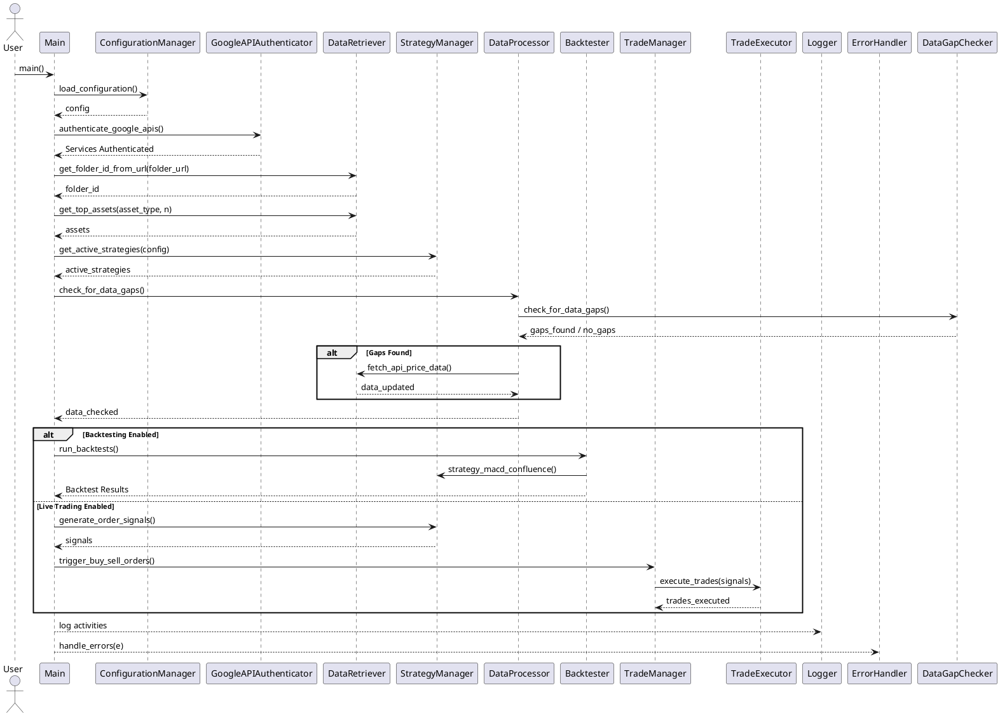
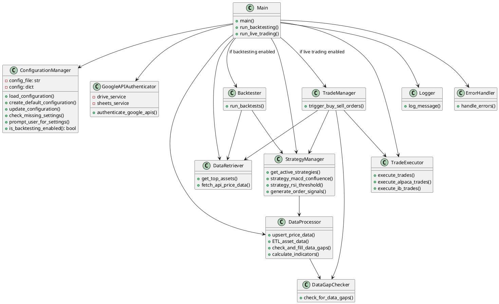
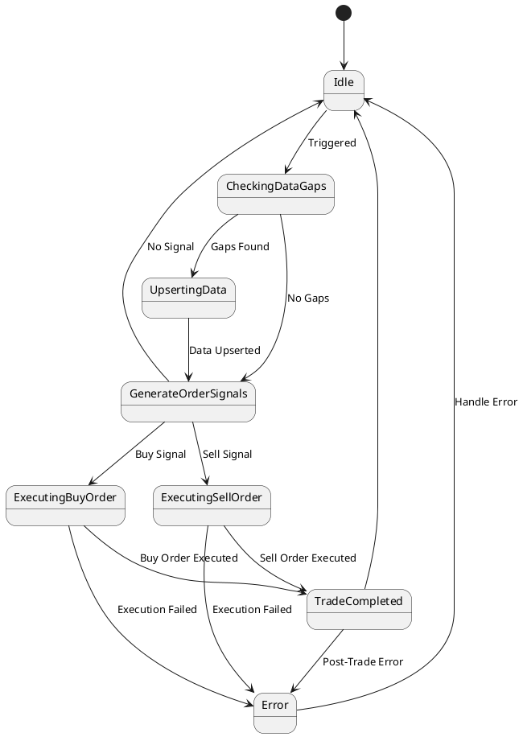

# Trading tool documentation

This document encapsulates the key aspects of our recent conversation regarding the development and refinement of UML diagrams for a Python trading script project. It serves as a comprehensive guide to ensure seamless continuity in future interactions with ChatGPT.
---

## Bullet-Point Summary

- **Project Focus:** Development of UML diagrams for a Python trading script utilizing a Multi-Timeframe MACD Confluence Strategy.
- **Initial UML Diagrams Created:**
  - Use Case Diagram
  - Class Diagram
  - Sequence Diagram
  - Activity Diagram
  - State Diagram
  - Component Diagram
- **Key Modifications:**
  - Separation of backtesting functions from live trading functions.
  - Introduction of new classes: `Backtester`, `DataGapChecker`, and `TradeManager`.
  - Integration of `IndicatorCalculator` within `DataProcessor`.
  - Renaming of "Generate Signals" to "Generate Order Signals" for clarity.
  - Removal of redundant data gap checks in the live trading path.
  - Renaming of `fetch_price_data` to `fetch_api_price_data`.
- **Workflow Enhancements:**
  - Conditional execution paths based on configuration settings (backtesting vs. live trading).
  - Ensuring data integrity by checking for data gaps prior to backtesting or live trading.
- **Documentation Updates:**
  - Iterative refinement of UML diagrams to reflect structural and functional changes.
  - Clarification of specific workflow steps, such as "Generate Order Signals."

---

## Decisions Made

1. **Separation of Functionalities:**
   - **Backtesting** and **Live Trading** are to be handled in distinct workflows to prevent simultaneous execution.
2. **Class Structure Refinement:**
   - Introduced new classes (`Backtester`, `DataGapChecker`, `TradeManager`) to encapsulate specific functionalities.
   - `IndicatorCalculator` is integrated within the `DataProcessor` class to handle indicator calculations as part of the ETL process.
3. **Workflow Optimization:**
   - `check_for_data_gaps()` is executed immediately after retrieving active strategies to ensure data currency for both backtesting and live trading.
   - Removed redundant data gap checks within the live trading execution path.
4. **Naming Conventions:**
   - Renamed "Generate Signals" to "Generate Order Signals" across all UML diagrams for enhanced clarity.
   - Renamed the function `fetch_price_data` to `fetch_api_price_data` to better reflect its purpose.

---

## Constraints Identified

- **Mutual Exclusivity of Modes:**
  - The system must operate in either **backtesting** mode or **live trading** mode at any given time, not both simultaneously.
- **Data Integrity:**
  - Ensuring that all data gaps are addressed before initiating backtesting or live trading to maintain accuracy and reliability.
- **Manual Invocation:**
  - Certain functions, like `upsert_price_data`, are designed to be invoked manually, adding a layer of control for the user.

---

## Key Insights

- **Modular Design:** Breaking down functionalities into distinct classes and modules (e.g., `Backtester`, `TradeManager`) enhances maintainability and scalability.
- **Data Processing Integration:** Incorporating `IndicatorCalculator` within `DataProcessor` streamlines the ETL process, ensuring that indicator calculations are tightly coupled with data handling.
- **Clear Separation of Concerns:** Differentiating between backtesting and live trading workflows prevents operational conflicts and promotes focused functionality.
- **Enhanced Clarity through Naming:** Precise naming conventions, such as changing to "Generate Order Signals," improve the comprehensibility of the system's processes.

---

## Chronological Progression

1. **Initial UML Diagram Creation:**
   - Developed foundational UML diagrams to outline the Python trading script's structure and functionalities.
2. **Incorporation of Partitions:**
   - Added partitions to separate backtesting functions from live trading functions.
   - Introduced manual invocation capability for `upsert_price_data`.
3. **Introduction of New Classes:**
   - Added `Backtester`, `DataGapChecker`, and `TradeManager` to handle specific workflows.
4. **Refinement of Class Relationships:**
   - Integrated `IndicatorCalculator` within `DataProcessor`.
   - Removed direct dependency between `StrategyManager` and `IndicatorCalculator`.
5. **Function Renaming and Streamlining:**
   - Renamed `fetch_price_data` to `fetch_api_price_data`.
   - Removed redundant data gap checks in the live trading sequence.
6. **Clarification of Workflow Steps:**
   - Renamed "Generate Signals" to "Generate Order Signals" for specificity.
   - Detailed the "Generate Order Signals" step in the Activity Diagram.
7. **Final Adjustments:**
   - Ensured consistency across all UML diagrams reflecting the latest structural and functional changes.

---

## Code Snippets to Be Used

### 1. **Class Diagrams**

```python
class StrategyManager:
    def get_active_strategies(self, config):
        """
        Retrieve the list of active strategies from the configuration.
        """
        active_strategies = [strategy for strategy, is_active in config['strategies'].items() if is_active]
        return active_strategies

    def strategy_macd_confluence(self, data):
        """
        Implement the MACD Multi-Timeframe Momentum Highlighter strategy.
        """
        # Strategy implementation
        pass

    def strategy_rsi_threshold(self, data):
        """
        Implement an RSI threshold strategy.
        """
        # Strategy implementation
        pass

    def generate_order_signals(self, data):
        """
        Generate buy and sell signals based on active strategies.
        """
        signals = {}
        if 'macd_confluence' in active_strategies:
            signals['macd_confluence'] = self.strategy_macd_confluence(data)
        if 'rsi_threshold' in active_strategies:
            signals['rsi_threshold'] = self.strategy_rsi_threshold(data)
        return signals
```

### 2. **Sequence Diagrams**



### 3. **Activity Diagrams**

```plantuml
@startuml
start

:Load Configuration;
:Authenticate with Google APIs;
:Retrieve Folder ID;
:Get Top Assets;
:Get Active Strategies;

:Check for Data Gaps;
if (Gaps Found?) then (yes)
    :Upsert Price Data;
else (no)
    :Proceed;
endif

if (Backtesting Enabled?) then (yes)
    partition Backtesting {
        :Run Backtests;
        :Generate Backtest Reports;
    }
else (no)
    partition Live_Trading {
        :Generate Order Signals;
        note right of Generate Order Signals
            Analyzes asset data using active strategies
            and technical indicators to identify
            buy/sell opportunities.
        end note
        :Trigger Buy/Sell Orders;
    }
endif

:Handle Errors;

stop
@enduml
```

### 4. **Class Diagrams**



### 5. **State Diagrams**


